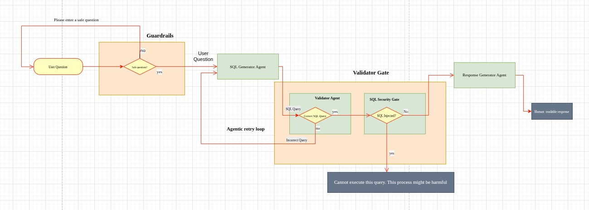

# Query Mate: Chat With Your Database
**TL, DR:** A **Secure** Retrieval-Augmented Text-to-SQL System for Large Relational Databases.

Most agentic AI frameworks, such as **LlamaIndex**, **CrewAI**, and **LangChain**, provide natural language querying capabilities via or help of tools calls, that translate questions into SQL and return responses in human-readable formats. However, these frameworks also leave room for a series of gaps that require urgent, meticulous, and painstaking solutions. They are not designed with security in mind, at heart, or at their core — and relational database systems contain sensitive information that must be protected, with rigorous security measures applied accordingly.

The goal here is to develop an intelligent database querying system that is secure-first in mind, in core, and in design — one that enables users, most especially non-technical users such as stakeholders, to interact with their relational databases using natural language instead of SQL syntax. This stands in contrast to most of the aforementioned agentic AI frameworks, whose 'one' or 'some' of their capabilities are primarily designed for developers, excluding stakeholders entirely, while also lacking security. Here, handling of databases with a large number of tables, as well as security concerns and credential protection measures, are enforced and highly considered throughout this project's implementation.

## High-Level System Design

  

## Core Functionality
The system provides a natural language interface for querying relational databases through the following workflow: 
- Database Connection: Users establish a read-only connection to their database.
- Natural Language Input: Users submit questions in plain english.
- SQL Translation: The LLM converts the natural language question into a valid SQL query.
- Query Execution: The generated SQL query retrieves requested information from the database 
- Response Generation: The LLM transforms the database results into a natural language response 
- User Display: The formatted answer is presented to the user through a web interface

## Supported Databases 
Currently, this package only provides support for three relational database management systems (RDBMS). They are:
- PostgreSQL 
- SQLite 
- MySQL

## Key Components 
- LLM Integration: Natural language processing for query translation and response generation 
- Database Schema Understanding: Object-Relational Mapping (ORM) to enable the LLM to comprehend database structure, relationships, and constraints 
- Agents: Intelligent agent for query generation, validation and human readable responses generation
- Web User Interface: Browser-based interface for user interaction 
- Read-Only Access Control: Security enforcement to prevent data modification 
- Guardrails: Security enforcement to prevent data modification 

## System Architecture 
This system operates or functions as an AI-assisted database agent that: 
- Maintains comprehensive knowledge of the connected database schema through ORM
- Translates natural language to SQL with contextual understanding 
- Executes queries safely with read-only permissions 
- Provides human-friendly explanations of query results 

## Use Cases 
- Non-technical users (Stakeholders) querying databases without SQL knowledge 
- Rapid data exploration and analysis 
- Business intelligence and reporting through conversational interface 
- Database documentation and understanding through natural language queries 

## Security Considerations 
- Enforced read-only database access 
- Query validation before execution 
- No data modification capabilities 
- Secure database credential handling: Ensure that database credentials are collected securely.

## all tests
uv run pytest tests/ -v

### only the package tests
uv run pytest tests/querymate/ -v

### only the API tests
uv run pytest tests/api/ -v